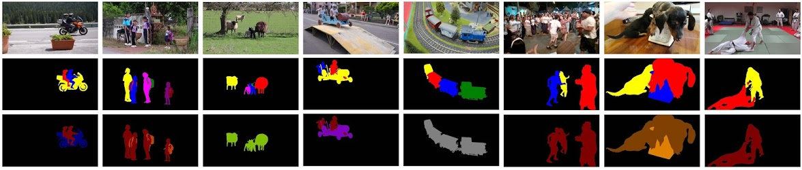

Benchmark Dataset and Evaluation Code for Video Semantic Salient Instance Segmentation
=====================================================================================

This project is based on [DAVIS Challenge Evaluation Code](https://github.com/davisvideochallenge/davis-matlab).

Raw dataset is downloaded from [DAVIS Challenge website](https://davischallenge.org/davis2016/code.html). Our SESIV annotation and baseline results are downloaded from [my website](https://sites.google.com/view/ltnghia/research/sesiv).

Citation
--------------

Please cite the following papers: 

    @inproceedings{ltnghia-wacv2019,
      author = {Trung-Nghia Le and Akihiro Sugimoto},
      title = {Semantic Instance Meets Salient Object: Study on Video Semantic Salient Instance Segmentation},
      booktitle = {IEEE Winter Conference on Applications of Computer Vision},
      year = {2019}
    }

    @article{Pont-Tuset_arXiv_2017,
      author = {Jordi Pont-Tuset and Federico Perazzi and Sergi Caelles and Pablo Arbel\'aez and Alexander Sorkine-Hornung and Luc {Van Gool}},
      title = {The 2017 DAVIS Challenge on Video Object Segmentation},
      journal = {arXiv: 1704.00675},
      year = {2017}
    }

Contact: [Trung-Nghia Le](https://sites.google.com/view/ltnghia).
